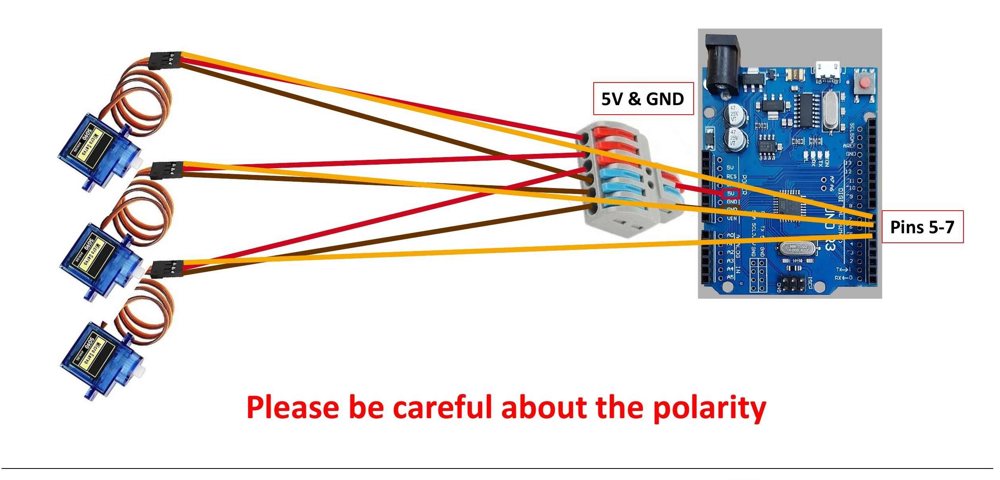
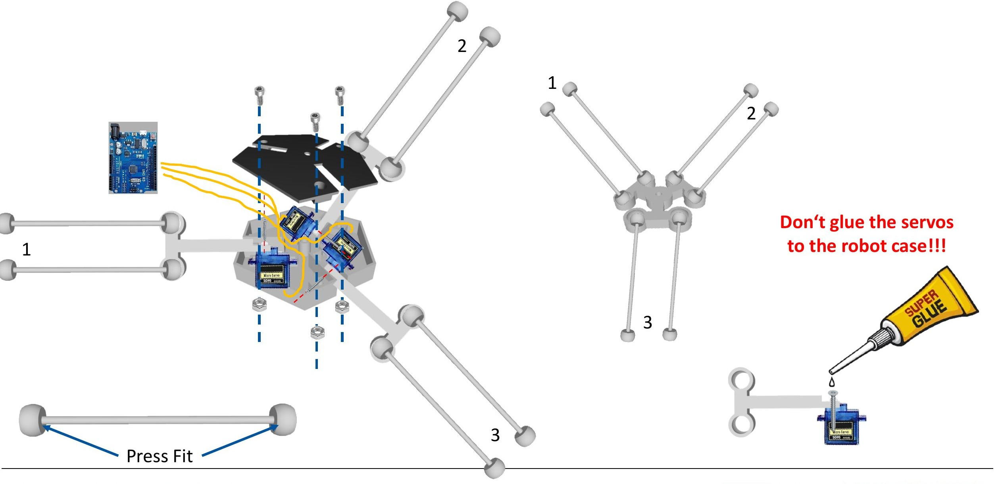

# Delta Robot Assembly and Control using ROS2

<p align="center">
  
</p>

<p align="center">
  
  
  
  
  
  
  
</p>

## Project Overview

This repository contains the full implementation for the **Robot Operating System Essentials – Summer School** project at **RWTH Aachen University**:

> **Delta Robot Assembly and Control using ROS**

*Authors: Giacomo Demetrio Masone, Mehmet Furkan Sahin*
*Robot Operating System Essentials — Summer School | RWTH Aachen University | July 2026*

The project takes a 3-DOF delta parallel robot from bare hardware to full ROS2 control, across seven exercises grouped into three phases:

- **Build** — wire and assemble the physical delta robot, program the Arduino
- **Simulate** — visualize the robot in RViz2, implement forward and inverse kinematics
- **Control** — execute full trajectories through a ROS2 action server, connect to the real robot

Everything is implemented in **C++/Arduino** for the low-level servo control and **ROS2** (Python/C++ nodes, custom services and actions) for the higher-level control stack.

---

## Table of Contents

1. [Project Motivation](#1-project-motivation)
2. [System Architecture](#2-system-architecture)
3. [Exercise 1: Delta Robot Assembly](#3-exercise-1-delta-robot-assembly)
4. [Exercise 2: Arduino Programming](#4-exercise-2-arduino-programming)
5. [Exercise 3: ROS Visualization](#5-exercise-3-ros-visualization)
6. [Exercise 4: Direct Kinematics](#6-exercise-4-direct-kinematics)
7. [Exercise 5: Inverse Kinematics](#7-exercise-5-inverse-kinematics)
8. [Exercise 6: Trajectory Action Server](#8-exercise-6-trajectory-action-server)
9. [Exercise 7: Connecting to the Real Delta](#9-exercise-7-connecting-to-the-real-delta)
10. [Repository Structure](#10-repository-structure)
11. [Installation](#11-installation)
12. [Results & Conclusions](#12-results--conclusions)
13. [Future Work](#13-future-work)
14. [References](#14-references)
15. [Acknowledgements](#15-acknowledgements)

---

## 1. Project Motivation

Delta robots are widely used in pick-and-place and packaging applications thanks to their **high speed and precision**, achieved through a parallel-arm structure rather than a serial kinematic chain. This structure, however, makes them a good teaching platform for a specific set of robotics challenges that a serial-arm robot doesn't expose as clearly:

- **Loop-closure constraints** — the three arms must stay kinematically consistent, which off-the-shelf ROS2 tools (like `joint_state_publisher_gui`) don't enforce out of the box
- **Inverse kinematics as a service** — converting a Cartesian target into three joint angles is naturally expressed as a ROS2 service call
- **Trajectory execution with feedback** — moving through a sequence of waypoints, with the ability to cancel, abort, and report progress, maps directly onto the ROS2 action server pattern

This project walks through all of the above, starting from a soldering iron and an Arduino and ending with a ROS2 action server driving the physical robot.

---

## 2. System Architecture

```
┌───────────────┐     serial      ┌────────────────┐
│   Arduino Uno │◀───────────────▶│   ROS2 nodes   │
│  (3x SG90)    │  target angles /│  (ikin_server,  │
│               │  joint state    │ trajPlan_server)│
└───────────────┘                 └────────┬────────┘
                                            │
                     ┌──────────────────────┼──────────────────────┐
                     ▼                      ▼                      ▼
           delta_joint_pub        robot_state_publisher          rviz2
        (direct kinematics,      (joint angles → TF)      (3D visualization)
         loop-closure enforced)
```

**Pipeline summary:**

- **Arduino** — reads target joint angles over serial, drives the three SG90 servos, smooths motion with joint-space interpolation
- **`delta_robot_description`** — URDF, meshes, and launch files describing the robot for RViz2
- **`delta_robot_serial`** — custom joint-state publisher (`delta_joint_pub`) that enforces the delta's loop-closure constraints via direct kinematics
- **`delta_ikin`** — the `Ikin.srv` service and `ikin_server` node that convert a target `(x, y, z)` into joint angles
- **`delta_trajectory`** — the `PosTraj.action` action server that executes a full trajectory, waypoint by waypoint, with live feedback

---

## 3. Exercise 1: Delta Robot Assembly

<p align="center">
  
  
</p>

**Goal:** build and wire the 3-DOF delta robot before any ROS control is introduced.

| Step | Description |
|---|---|
| **1. Wiring** | Three SG90 micro servos wired to an Arduino Uno on digital pins 5–7, powered via 5V/GND through a terminal block; polarity checked carefully. |
| **2. Electronics test** | Custom `Test_Servos.ino` sketch used to sweep and verify each servo individually before touching the mechanics. |
| **3. Zero position & orientation check** | Servos set to 0°; arm direction verified with spare test arms (screwing shifted the angles slightly, so this was rechecked after mounting). |
| **4. Final assembly** | Ball joints press-fit onto the parallelogram arms, then arms screwed and glued to the servo horns only — **never to the robot case**. |

> **Key lesson:** arms glued in the wrong orientation permanently limit the robot's reachable workspace. Always test-fit before super-gluing.

---

## 4. Exercise 2: Arduino Programming

**Goal:** convert a target end-effector position into smooth servo motion, entirely on the Arduino.

| Step | Description |
|---|---|
| **1. Inverse kinematics — `Delta_IK.ino`** | `inverse_kinematics()` converts a target `(x, y, z)` into the three joint angles, using the delta robot's link lengths and arm offsets from the kinematics lecture. |
| **2. Serial Monitor testing** | Comma-separated target positions typed into the Serial Monitor; the Arduino computes the joint angles, checks the 0–90° range, and moves the servos. |
| **3. Speed smoother — `Control_Delta.ino`** | Replaced abrupt jumps with joint-space linear interpolation: each move is split into 50 steps of 20 ms. |

```cpp
// Control_Delta.ino
void speed_smoother(
    double target_phi1,
    double target_phi2,
    double target_phi3) {

  int steps = 50;
  int sampling_time = 20; // ms

  for (int i = 1; i <= steps; i++) {
    servo1.write(round(start_phi1 + i * step_phi1));
    servo2.write(round(start_phi2 + i * step_phi2));
    servo3.write(round(start_phi3 + i * step_phi3));

    delay(sampling_time);
  }
}
```

> **Stretch goal:** swap the linear interpolator for a cubic/quintic polynomial timing law for smoother velocity and acceleration profiles.

---

## 5. Exercise 3: ROS Visualization

**Goal:** first contact with ROS2 packages, nodes, and seeing the robot rendered for the first time.

```
joint_state_publisher_gui  ──▶  robot_state_publisher  ──▶  rviz2
   (sliders → joint angles)   (joint angles → link TF)   (3D visualization)
```

| Step | Description |
|---|---|
| **1. Package & workspace** | Created the `delta_robot_description` ROS2 package (`ros2 pkg create`), added URDF/meshes/launch files, built with `colcon build`. |
| **2. Three nodes, one pipeline** | `joint_state_publisher_gui` → `robot_state_publisher` → `rviz2`. |
| **3. Launch file** | Combined all three nodes into a single `JointStatePublisher.launch` file, replacing three separate terminals with one `ros2 launch` command. |

> **Debugging lesson:** most ROS2 errors trace back to forgetting to source the workspace (`source install/setup.bash`) in a new terminal.

---

## 6. Exercise 4: Direct Kinematics

**Goal:** write a custom joint-state publisher so the delta robot assembles correctly in RViz.

| | Model | Result |
|---|---|---|
| ✗ **Before** | `joint_state_publisher_gui` | Open-chain model, extra sliders — arms don't connect to the platform. |
| ✓ **After** | `delta_joint_pub` (custom) | `direct_kinematics()` enforces loop closure — robot renders correctly assembled. |

| Step | Description |
|---|---|
| **1. The problem** | RViz can't enforce the delta robot's loop-closure constraints, so `joint_state_publisher_gui` treats it as an open chain. |
| **2. Custom publisher — `delta_joint_pub`** | Reads the 3 actuated angles over serial, calls `direct_kinematics()` to compute all 12 link positions consistently, publishes to `/joint_states`. |
| **3. New package & launch file** | Built the `delta_robot_serial` package (`pseudo_arduino` + `delta_joint_pub`) and a `PseudoArduino.launch` file starting both nodes plus `rviz2`. |

> **Testing tip:** change the `target_angle` values in `pseudo_arduino.cpp` to asymmetric angles and rebuild — a correct model stays fully assembled at any pose.

---

## 7. Exercise 5: Inverse Kinematics

**Goal:** close the loop with a ROS2 service that turns a target position into joint angles.

```
Request: x, y, z  ──▶  ikin_server  ──▶  Response: phi_11, phi_12, phi_13
(target position)   inverse_kinematics()      (joint angles, degrees)
                     + sendToSerial()
```

| Step | Description |
|---|---|
| **1. `Ikin.srv` — the service definition** | Request: effector position `(x, y, z)` as `float64`. Response: three joint angles `(phi_11, phi_12, phi_13)` in degrees. |
| **2. `ikin_server` node** | The `/ikin` server callback calls `inverse_kinematics()` on the request, then `sendToSerial()` forwards the joint angles to the Arduino. |
| **3. Testing with RQT** | Used the RQT Service Caller panel to call `/ikin` with a target `(x, y, z)` and watched the robot jump to pose in RViz. |

> **NaN guard:** only real numbers reach the Arduino — if `inverse_kinematics()` returns NaN for an unreachable position, the request is ignored.

---

## 8. Exercise 6: Trajectory Action Server

**Goal:** go beyond point-to-point control with an action server that executes a full trajectory with live feedback.

```
Goal: x, y, z  ──▶  Waypoint loop (ikin_server call, 1Hz feedback)  ──▶  Result: Succeeded / Aborted / Canceled
```

| Step | Description |
|---|---|
| **1. `PosTraj.action`** | Goal, result, and feedback blocks (in that order), each holding an `(x, y, z)` position — the same format as the `Ikin` service. |
| **2. `trajPlan_actionServer`** | A dynamically-linked component node, client to `ikin_server`, subscribing to `/joint_states` for the current position. |
| **3. Execution loop** | Per waypoint: check for cancellation → call `ikin_server` → publish feedback at 1Hz → abort on invalid response → succeed after the last waypoint. |

> **Dynamic linking:** no `main()` — `RCLCPP_COMPONENTS_REGISTER_NODE(TrajectoryPlanServer)` instantiates and spins the class automatically.

---

## 9. Exercise 7: Connecting to the Real Delta

**Goal:** move from the simulated `pseudo_arduino` node to the physical robot.

```
ls /dev (before/after)  ──▶  update serial_port in launch files  ──▶  match servo pins to Real Delta Robot
```

| Step | Description |
|---|---|
| **1. Find the serial port** | `ls /dev` before/after plugging in the Arduino to spot the new device (`ttyUSB0` or `ttyACM0`). |
| **2. Point the launch file at it** | Updated `serial_port` in `Arduino.launch` and `ArduinoTraj.launch`. |
| **3. Match the servo pins** | Isolated each pin with `Servo_test.ino`, matched it against the demonstrator robot's arm layout, mirrored the mapping into `Control_Delta.ino`. |

> **Gotcha:** the serial port name can change on every reconnect — re-check it each session.

---

## 10. Repository Structure

```
delta_robot_summer_school/
├── arduino/
│   ├── Test_Servos/           # per-servo sweep test (Exercise 1)
│   ├── Delta_IK/               # inverse kinematics + serial interface (Exercise 2)
│   └── Control_Delta/          # speed smoother / final control sketch (Exercise 2, 7)
├── ros2_ws/
│   └── src/
│       ├── delta_robot_description/   # URDF, meshes, RViz launch (Exercise 3)
│       ├── delta_robot_serial/        # pseudo_arduino + delta_joint_pub (Exercise 4)
│       ├── delta_ikin/                # Ikin.srv + ikin_server (Exercise 5)
│       └── delta_trajectory/          # PosTraj.action + trajPlan_actionServer (Exercise 6)
├── docs/
│   └── images/                 # diagrams and reference images used in this README
├── requirements.txt
├── LICENSE
└── README.md
```

---

## 11. Installation

### Prerequisites

| Requirement | Version |
|---|---|
| Arduino IDE | 2.x |
| ROS2 | Humble (or later) |
| Python | 3.8+ |
| colcon | latest |

### Step 1: Clone the repository

```bash
git clone https://github.com/<your-username>/delta_robot_summer_school.git
cd delta_robot_summer_school
```

### Step 2: Flash the Arduino

Open `arduino/Control_Delta/Control_Delta.ino` in the Arduino IDE, select the correct board/port, and upload.

### Step 3: Build the ROS2 workspace

```bash
cd ros2_ws
colcon build
source install/setup.bash
```

### Step 4: Launch the visualization pipeline

```bash
ros2 launch delta_robot_description JointStatePublisher.launch.py
```

### Step 5: Launch the full control stack

```bash
ros2 launch delta_robot_serial PseudoArduino.launch.py
ros2 run delta_ikin ikin_server
ros2 run delta_trajectory trajPlan_actionServer
```

---

## 12. Results & Conclusions

Seven exercises, three phases, one delta robot brought fully under ROS2 control:

**PHASE 01 · BUILD**
- ✅ Built the delta robot
- ✅ Programmed the Arduino interface

**PHASE 02 · SIMULATE**
- ✅ Visualized the robot in ROS
- ✅ Implemented direct (forward) kinematics
- ✅ Implemented inverse kinematics

**PHASE 03 · CONTROL**
- ✅ Executed full trajectories through the action server
- 🔄 Connected to the physical robot (workflow validated in simulation; hardware connection pending at time of writing)

---

## 13. Future Work

- **Cubic/quintic trajectory timing** — replace the linear speed smoother with a polynomial law for smoother acceleration profiles
- **Closed-loop control** — add position/force feedback from the physical servos rather than open-loop angle commands
- **Workspace visualization** — compute and plot the reachable workspace directly from the link geometry
- **Full hardware validation** — complete the real-robot connection (Exercise 7) and compare simulated vs. physical trajectory tracking

---

## 14. References

- Lecture materials: *Robot Operating System Essentials – Summer School*, RWTH Aachen University (2026)
- Delta robot kinematics derivation, course kinematics lecture notes
- [ROS2 Documentation](https://docs.ros.org/)
- [Arduino Servo Library](https://www.arduino.cc/reference/en/libraries/servo/)

---

## 15. Acknowledgements

This project was completed as part of the **Robot Operating System Essentials – Summer School** at **RWTH Aachen University**.

- **Course instructors and teaching assistants** — for guidance throughout the exercises
- **Giacomo Demetrio Masone & Mehmet Furkan Sahin** — project authors
